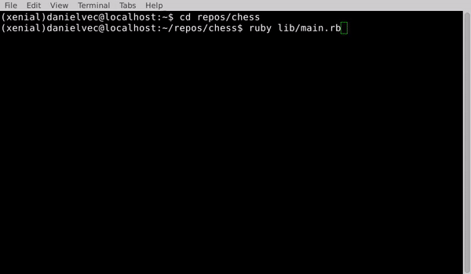

# Chess

This is my implementation of Chess from the [Ruby Final Project from The Odin Project](https://www.theodinproject.com/lessons/ruby-ruby-final-project).

 

[Click here to play](https://replit.com/@danielvec/chess)

## Getting Started

If you have never played chess before, [click here](https://www.chess.com/learn-how-to-play-chess) for a guide.

**Prerequisites**  
Ruby >= 3.1.2

**Installation**  
`git clone https://github.com/danielvec/chess/`  
`cd chess`  
`gem install colorize`

## How to Play
**Starting a New Game**

Run `ruby lib/main.rb`

Type `N` to start a new game.

**Selecting a Piece to Move**

Select the piece you would like to move by typing the letter of the column and the number of the row. 
For example, to move the white pawn on the far left side of the board, type `A2`.

If a piece is chosen that has no valid moves, the program will output `Selected piece has no valid moves.` and you will be prompted to choose a different piece.

If the row and column input do not correspond to one of your pieces, the program will output `Input Error!` and you will need to enter a valid input.

The touch-move rule is implemented, that is, once a valid piece is selected you may not choose a different piece to move on that turn.

**Selecting a Space to Move to**

As with selecting a piece to move, select the space you would like to move to by typing the letter of the column and the number of the row. 
For example, to move the white pawn on the far left side of the board one space up, type `A3`.

All legal moves are highlighted in red. If the space you try to move to is not red, it is an illegal move and the program will output `Invalid move!` and you will need to enter a valid input.

**Castling**

When castling, first select your King and then type in the row and column of the space where your king will move to. The castle will move on its own without needing to be selected.

**Pawn Promotion**

Once a pawn is in position for promotion, you will be prompted `Enter 'Q' for Queen, 'R' for Rook, 'K' for Knight, or 'B' for Bishop`. Type in the letter for the piece you would like to promote to. For example. for Queen type `Q`.

**Saving the Game**

At any time, you may type in `S` to save the game and exit. To exit without saving, type `E`.

**Loading Saved Game**

Run `ruby lib/main.rb`

Type `L` to load saved game.

## Rspec Tests

To run the tests, enter:  
`rspec`

